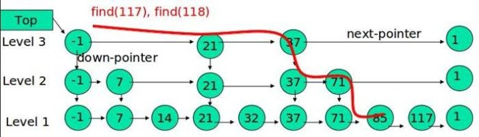

# MyLeveldb
为了提升码力，照抄一遍leveldb，利用commit组织从0开始一步步构建过程，方便学习，也包括必要的注释和学习笔记。

# 基础组件

## status

用于记录leveldb中状态信息，保存错误码和对应的字符串错误信息(不过不支持自定义)。其基本组成


```c++
 private:
  enum Code {
    kOk = 0,
    kNotFound = 1,
    kCorruption = 2,
    kNotSupported = 3,
    kInvalidArgument = 4,
    kIOError = 5
  };

Status::Status(Code code, const Slice& msg, const Slice& msg2) {
  assert(code != kOk);
  const uint32_t len1 = static_cast<uint32_t>(msg.size());
  const uint32_t len2 = static_cast<uint32_t>(msg2.size());
  const uint32_t size = len1 + (len2 ? (2 + len2) : 0);
  char* result = new char[size + 5];
  std::memcpy(result, &size, sizeof(size));
  result[4] = static_cast<char>(code);
  std::memcpy(result + 5, msg.data(), len);
  if (len2) {
    result[5 + len1] = ':';
    result[6 + len1] = ' ';
    std::memcpy(result + 7 + len1, msg2.data(), len2);
  }
  state_ = result;
}
```

## 编码

leveldb中分为定长和变长编码，其中变长编码目的是为了减少空间占用，比如一个int类型的值，哪怕值只是1也要占用4个字节的空间，这对于数据库存储来说是具有很大的优化空间的。实际上平时用到的大部分数据都是比较小的。其基本思想是：每一个Byte最高位bit用0/1表示该整数是否结束，用剩余7bit表示实际的数值，在protobuf中被广泛使用。utf-8编码，base64编码都是类似的处理方式。额外的损失是编解码会耗一点点cpu。基本上可以接受。

## Arena  

于分配空间，不含有GC & RC.

Arena 主要与 MemTable 关联使用，实际主要用于 SkipList 中的 Node 内存分配，统一 MemTable 的内存分配需求，减少内存分配的实际系统调用次数（尤其针对小块内存），减少内存分配中的空洞（碎片），但也会造成一定的内存浪费；统一内存释放，不必频繁 new/delete；鉴于 Arena 在 leveldb 中的使用场景不需考虑线程安全。Arena 的实现简单轻量，代码总计百余行，服务于 leveldb 的定制需求，提高应用性能，并且提供了内存对齐的版本。

Arena 每次按 kBlockSize(4096)单位向系统申请内存， 提供地址对齐的内存，记录内存使用。当申请内存时，如果 size 不大kBlockSize 的四分之一，就在当前空闲的内存 block 中分配，否则，直接向系统申请（malloc） 。这个策略是为了能更好的服务小内存的申请，避免个别大内存使用影响  

## skiplist

是leveldb的一个核心的数据结构。是一种可以代替平衡树的数据结构，可以看做是**并联的有序链表**。跳跃表通过概率保证平衡，而平衡树采用严格的旋转来保证平衡，因此跳跃表比较容易实现，而且相比平衡树有着较高的运行效率。

平时选择数据结构，通常考虑看是查询的多，还是插入删除的多。查询的多就用平衡树，插入删除的多就用常规链表。

常规的有序单链表，查询的时候只能从头到尾遍历的查。图中最顶部就是一个单链表。既然是有序的链表，那能不能把链表里，部分元素拿出来再搞一层。就像图中中间的结构，查43这个值，不从最底层，从上一层开始查，大于34小于50，说明不在这一层，就从34跳到下一层开始查。马上就能查到了。

元素比较多的时候，就一层复杂度还是比较高，就可以搞多层。具体多少层，可以根据需要通过参数控制。


如果 node 的高度具有随机性，数据集合从高度层次上看就有了散列性，也就等同于树的平衡。相对于其他树型数据结构采用不同策略来保证平衡状态， Skip list 仅保证新加入 node 的高度随机即可（当然也可以采用规划计算的方式确定高度，以获得平摊复杂度。 leveldb 采用的是更简 单的随机方式）

如前所述，作为随机性的数据机构， skip list 的算法复杂度依赖于我们的随机假设， 复杂度为 O（logn）   

基于下面两个特点， skiplist 中的操作不需要任何锁或者 node 的引用计数：  

\1) skip list 中 node 内保存的是 InternalKey 与相应 value 组成的数据， SequnceNumber 的全局唯一保证了不会有相同的 node 出现，也就保证了不会有 node 更新的情况。  

\2) delete 等同于 put 操作，所以不会需要引用计数记录 node 的存活周期。  

### FindGreaterOrEqual

跳表实际上是类似一种多层的有序链表，高层的链表比底层的链表节点更少，在更高层的链表上能更快的遍历完整个链表，跳到更底层的链表更利于精确的定位，以上便是skiplist利用空间换取时间的方法精髓。想首先从跳表头结点的最高层开始遍历，key值大于节点key值，则前往同一层的下一个节点，否则跳到节点的低一层并记录上一层的最后访问的节点，直到来到第一层（最底层）。类似的函数还有FindLessThan，FindLast



其实FindGreaterOrEqual函数返回的前向节点指针数组是为了向跳表插入节点时用的，想想链表的插入操作，insert一个key时，首先新建一个node(key)，把node->next指向prev-next，再把prev->next指向node。跳表也是，只不过需要操作多个链表。 对各个高度的链表做 insert 即可。  
